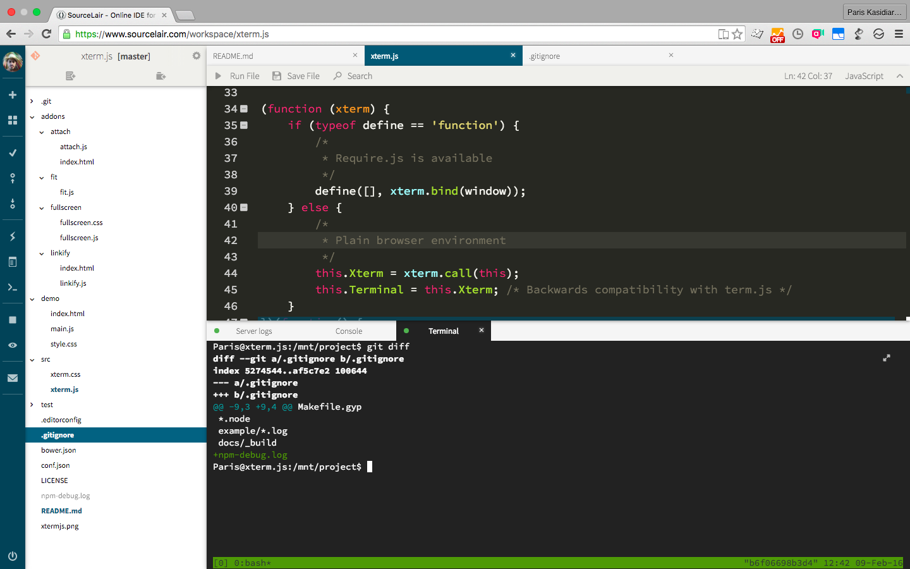

# xterm.js


Xterm.js is a full xterm clone, written in JavaScript.

It is used at [SourceLair](https://www.sourcelair.com/home) to help people develop their applications in their browsers.

Xterm.js supplies a modular, event-based interface that lets developers build addons and themes on top of it.



## Browser Support

Since xterm.js is typically implemented as a developer tool, only modern browsers are supported officially. Here is a list of the versions we aim to support: 

- Chrome 48+
- Edge 13+
- Firefox 44+
- Internet Explorer 11+
- Opera 35+
- Safari 8+

xterm.js may work on earlier versions of the browsers but these are the browsers we strive to keep working.

## Demo

To launch the demo simply run:

```
npm install
npm start
```

Then open http://0.0.0.0:3000 in a web browser (use http://127.0.0.1:3000 is running under Windows).

## Addons

Addons are JavaScript modules that attach functions to the `Terminal` prototype to extend its functionality. There are a handful available in the main repository in the `addons` directory, you can even write your own (though they may break when the internals of xterm.js change across versions).

To use an addon, just include the JavaScript file after xterm.js and before the `Terminal` object has been instantiated. The function should then be exposed on the `Terminal` object:

```html
<script src="node_modules/src/xterm.js"></script>
<script src="node_modules/addons/fit/fit.js"></script>
```

```js
var xterm = new Terminal();
// init code...
xterm.fit();
```

## Development and Contribution

To contribute either code, documentation or issues to xterm.js please read the [Contributing document](CONTRIBUTING.md) before.

The development of xterm.js does not require any special tool. All you need is an editor that supports JavaScript and a browser (if you would like to run the demo you will need Node.js to get all features).

It is recommended though to use a development tool that uses xterm.js internally, to develop for xterm.js. [Eating our own dogfood](https://en.wikipedia.org/wiki/Eating_your_own_dog_food) has been proved extremely beneficial for this project. Known tools that use xterm.js internally are:

#### [SourceLair](https://www.sourcelair.com)

Visit https://lair.io/sourcelair/xterm and follow the instructions. All development will happen in your browser.

#### [Visual Studio Code](http://code.visualstudio.com/)

[Download Visual Studio Code](http://code.visualstudio.com/Download), clone xterm.js and you are all set.

## License Agreement

If you contribute code to this project, you are implicitly allowing your code to be distributed under the MIT license. You are also implicitly verifying that all code is your original work.

Copyright (c) 2014-2016, SourceLair, Private Company ([www.sourcelair.com](https://www.sourcelair.com/home)) (MIT License)

Copyright (c) 2012-2013, Christopher Jeffrey (MIT License)
