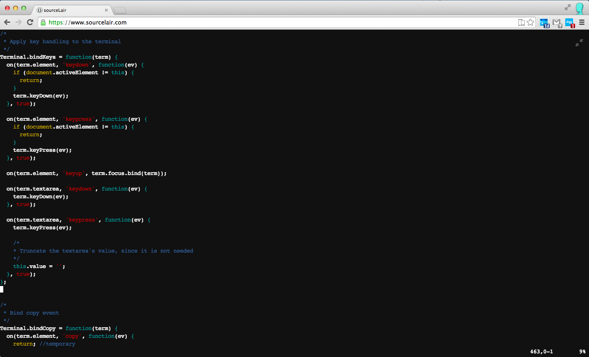

# xterm.js — xterm, in the browser

Xterm.js is a full xterm clone, written completely in JavaScript.

Xterm.js supplies a modular, event-based interface that lets developers build addons and themes that augment  the experience of running a fully-featured terminal inside the browser.

Xterm.js serves as foundation for the terminal found at www.sourcelair.com.

### Contribution and License Agreement

If you contribute code to this project, you are implicitly allowing your code to be distributed under the MIT license. You are also implicitly verifying that all code is your original work.

## License

Copyright (c) 2014-2015, SourceLair, Ltd (www.sourcelair.com) (MIT License)

Copyright (c) 2012-2013, Christopher Jeffrey (MIT License)
