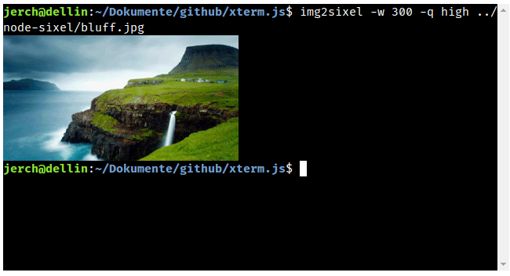

## @xterm/addon-image

Inline image output in xterm.js. Supports SIXEL and iTerm's inline image protocol (IIP).





### Install from npm

```bash
npm install --save @xterm/addon-image
```


### Usage

```ts
import { Terminal } from '@xterm/xterm';
import { ImageAddon, IImageAddonOptions } from '@xterm/addon-image';

// customize as needed (showing addon defaults)
const customSettings: IImageAddonOptions = {
  enableSizeReports: true,    // whether to enable CSI t reports (see below)
  pixelLimit: 16777216,       // max. pixel size of a single image
  sixelSupport: true,         // enable sixel support
  sixelScrolling: true,       // whether to scroll on image output
  sixelPaletteLimit: 256,     // initial sixel palette size
  sixelSizeLimit: 25000000,   // size limit of a single sixel sequence
  storageLimit: 128,          // FIFO storage limit in MB
  showPlaceholder: true,      // whether to show a placeholder for evicted images
  iipSupport: true,           // enable iTerm IIP support
  iipSizeLimit: 20000000      // size limit of a single IIP sequence
}

// initialization
const terminal = new Terminal();
const imageAddon = new ImageAddon(customSettings);
terminal.loadAddon(imageAddon);
```

### General Notes

- *IMPORTANT:* The worker approach as done in previous releases got removed.
  The addon contructor no longer expects a worker path as first argument.

- By default the addon will activate these `windowOptions` reports on the terminal:
  - getWinSizePixels (CSI 14 t)
  - getCellSizePixels (CSI 16 t)
  - getWinSizeChars (CSI 18 t)
  
  to help applications getting useful terminal metrics for their image preparations. Set `enableSizeReports` in the constructor options to `false`, if you dont want the addon to alter these terminal settings. This is especially useful, if you have very strict security needs not allowing any terminal reports, or deal with `windowOptions` by other means.


### Operation Modes

- **SIXEL Support**  
  Set by default, change it with `{sixelSupport: true}`.

- **Scrolling On | Off**  
  By default scrolling is on, thus an image will advance the cursor at the bottom if needed.
  (see cursor positioning).

  If scrolling is off, the image gets painted from the top left of the current viewport
  and might be truncated if the image exceeds the viewport size.
  The cursor position does not change.

  You can customize this behavior with the constructor option `{sixelScrolling: false}`
  or with `DECSET 80` (off, binary: `\x1b [ ? 80 h`) and
  `DECRST 80` (on, binary: `\x1b [ ? 80 l`) during runtime.

- **Cursor Positioning**  
  If scrolling is set, the cursor will be placed at the first image column of the last image row (VT340 mode).
  Other cursor positioning modes as used by xterm or mintty are not supported.

- **SIXEL Palette Handling**  
  By default the addon limits the palette size to 256 registers (as demanded by the DEC specification).
  The limit can be increased to a maximum of 4096 registers (via `sixelPaletteLimit`).

  The default palette is a mixture of VT340 colors (lower 16 registers), xterm colors (up to 256) and zeros (up to 4096).
  There is no private/shared palette distinction, palette colors are always carried over from a previous sixel image.
  Restoring the default palette size and colors is possible with `XTSMGRAPHICS 1 ; 2` (binary: `\x1b[?1;2S`).
  It gets also restored automatically on RIS and DECSTR.

  Other than on older terminals, the underlying SIXEL library applies colors immediately to individual pixels
  (*printer mode*), thus it is technically possible to use more colors in one image than the palette has color slots.
  This feature is called *high-color* in libsixel.

  A terminal wide shared palette mode with late indexed coloring of the output is not supported,
  therefore palette animations cannot be used.

- **SIXEL Raster Attributes Handling**  
  If raster attributes were found in the SIXEL data (level 2), the image will always be truncated to the given height/width extend. We deviate here from the specification on purpose, as it allows several processing optimizations. For level 1 SIXEL data without any raster attributes the image can freely grow in width and height up to the last data byte, which has a much higher processing penalty. In general encoding libraries should not create level 1 data anymore and should not produce pixel information beyond the announced height/width extend. Both is discouraged by the >30 years old specification.

  Currently the SIXEL implementation of the addon does not take custom pixel sizes into account, a SIXEL pixel will map 1:1 to a screen pixel.

- **IIP Support (iTerm's Inline Image Protocol)**  
  Set by default, change it with `{iipSupport: true}`.

  The IIP implementation has the following features / restrictions (sequence will silently fail for unmet conditions):
  - Supported formats: PNG, JPEG and GIF
  - No animation support.
  - Image type hinting is not supported (always deducted from data header).
  - File download is not supported.
  - Filename gets parsed but not used.
  - Strict base64 handling as of RFC4648 §4 (standard alphabet, optional padding, no separator bytes allowed).
  - Payload size may not exceed CEIL(sizeParameter * 4 / 3).
  - Image scaling beyond terminal viewport size is allowed (e.g. `width=200%`).
  - Image pixel size is restricted by `pixelLimit` (pre- and post resizing).
  - Size parameter is restricted by `iipSizeLimit`.
  - Cursor positioning behaves the same as for sixel (see above).


### Storage and Drawing Settings

The internal storage holds images up to `storageLimit` (in MB, calculated as 4-channel RBGA unpacked, default 100 MB). Once hit images get evicted by FIFO rules. Furthermore images on the alternate buffer will always be erased on buffer changes.

The addon exposes two properties to interact with the storage limits at runtime:
- `storageLimit`  
  Change the value to your needs at runtime. This is especially useful, if you have multiple terminal
  instances running, that all add to one upper memory limit.
- `storageUsage`  
  Inspect the current memory usage of the image storage.

By default the addon will show a placeholder pattern for evicted images that are still part
of the terminal (e.g. in the scrollback). The pattern can be deactivated by toggling `showPlaceholder`.

### Image Data Retrieval

The addon provides the following API endpoints to retrieve raw image data as canvas:

- `getImageAtBufferCell(x: number, y: number): HTMLCanvasElement | undefined`  
  Returns the canvas containing the original image data (not resized) at the given buffer position.
  The buffer position is the 0-based absolute index (including scrollback at top).

- `extractTileAtBufferCell(x: number, y: number): HTMLCanvasElement | undefined`  
  Returns a canvas containing the actual single tile image data (maybe resized) at the given buffer position.
  The buffer position is the 0-based absolute index (including scrollback at top).
  Note that the canvas gets created and data copied over for every call, thus it is not suitable for performance critical actions.

### Memory Usage

The addon does most image processing in Javascript and therefore can occupy a rather big amount of memory. To get an idea where the memory gets eaten, lets look at the data flow and processing steps:
- Incomming image data chunk at `term.write` (terminal)  
  `term.write` might stock up incoming chunks. To circumvent this, you will need proper flow control (see xterm.js docs). Note that with image output it is more likely to run into this issue, as it can create lots of MBs in very short time.
- Sequence Parser (terminal)  
  The parser operates on a buffer containing up to 2^17 codepoints (~0.5 MB).
- Sequence Handler - Chunk Decoding (addon)  
  Image data chunks are processed immediately by the SIXEL decoder (streamlined). The decoder allocates memory for image
  pixels as needed. The allowed image size is restricted by `pixelLimit` (default 16M pixels), the decoder holds 2 pixel buffers at maximum during decoding (RGBA, ~128 MB for 16M pixels).
- Sequence Handler - Image Finalization (addon) 
  After decoding the final pixel buffer is grabbed by the sequence handler and written to a canvas of the same size (~64 MB for 16M pixels) and added to the storage.
- Image Storage (addon)  
  The image storage implements a FIFO cache, that will remove old images, if a new one arrives and `storageLimit` is hit (default 128 MB). The storage holds a canvas with the original image, and may additionally hold resized versions of images after a font rescaling. Both are accounted in `storageUsage` as a rough estimation of _pixels x 4 channels_.

Following the steps above, a rough estimation of maximum memory usage by the addon can be calculated with these formulas (in bytes):
```typescript
// storage alone
const storageBytes = storageUsage * storageLimit * 1024 * 1024;
// decoding alone
const decodingBytes = sixelSizeLimit + 2 * (pixelLimit * 4);

// totals
// inactive decoding
const totalInactive = storageBytes;
// active decoding
const totalActive = storageBytes + decodingBytes;
```

Note that browsers have offloading tricks for rarely touched memory segments, esp. `storageBytes` might not directly translate into real memory usage. Usage peaks will happen during active decoding of multiple big images due to the need of 2 full pixel buffers at the same time, which cannot be offloaded. Thus you may want to keep an eye on `pixelLimit` under limited memory conditions.  
Further note that the formulas above do not respect the Javascript object's overhead. Compared to the raw buffer needs the book keeping by these objects is rather small (<<5%).

_Why should I care about memory usage at all?_  
Well you don't have to, and it probably will just work fine with the addon defaults. But for bigger integrations, where much more data is held in the Javascript context (like multiple terminals on one page), it is likely to hit the engine's memory limit sooner or later under decoding and/or storage pressure.

_How can I adjust the memory usage?_  
- `pixelLimit`  
  A constructor setting, thus you would have to anticipate, whether (multiple) terminals in your page gonna do lots of concurrent decoding. Since this is normally not the case and the memory usage is only temporarily peaking, a rather high value should work even with multiple terminals in one page.
- `storageLimit`  
  A constructor and a runtime setting. In conjunction with `storageUsage` you can do runtime checks and adjust the limit to your needs. If you have to lower the limit below the current usage, images will be removed in FIFO order and may turn into a placeholder in the terminal's scrollback (if `showPlaceholder` is set). When adjusting keep in mind to leave enough room for memory peaking for decoding.
- `sixelSizeLimit`  
  A constructor setting. This has only a small impact on peaking memory during decoding. It is meant to avoid processing of overly big or broken SIXEL sequences at an earlier phase, thus may stop the decoder from entering its memory intensive task for potentially invalid data.


### Terminal Interaction

- Images already on the terminal screen will reshape on font-rescaling to keep the terminal cell coverage intact.
  This behavior might diverge from other terminals, but is in general the more desired one.
- On terminal resize images may expand to the right automatically, if they were right-truncated before.
  They never expand to the bottom, if they were bottom-truncated before (e.g. from scrolling-off).
- Text autowrapping from terminal resize may break and wrap images into multiple parts. This is unfortunate,
  but cannot be avoided, while sticking to the stronger terminal text-grid mechanics.
  (Yes images are a second class citizen on a mainly text-driven interface.)
- Characters written over an image will erase the image information for affected cells.
- Images are painted above BG/FG data not erasing it. More advanced "composition tricks" like painting images
  below FG/BG data are not possible. (We currently dont hook into BG/FG rendering itself.)
- Previous image data at a cell will be erased on new image data. (We currently have no transparency composition.)


### Performance & Latency

- Performance should be good enough for occasional SIXEL output from REPLs, up to downscaled movies
  from `mpv` with its SIXEL renderer (tested in the demo). For 3rd party xterm.js integrations this
  furthermore depends highly on the overall incoming data throughput.
- Image processing has a high latency. Most of the latency though is inherited from xterm.js' incoming data route
  (PTY -> server process -> websocket -> xterm.js async parsing), where every step creates more waiting time.
  Since we cannot do much about that "long line", keep that in mind when you try to run more demanding applications with realtime drawing and interactive response needs.


### Status

- Sixel support and image handling in xterm.js is considered beta quality.
- IIP support is in alpha stage. Please file a bug for any awkwardities.


### Changelog

- 0.5.0 integrate with xtermjs base repo (at v0.4.3)
- 0.4.3 defer canvas creation
- 0.4.2 fix image canvas resize
- 0.4.1 compat release for xterm.js 5.2.0
- 0.4.0 IIP support
- 0.3.1 compat release for xterm.js 5.1.0
- 0.3.0 important change: worker removed from addon
- 0.2.0 compat release for xterm.js 5.0.0
- 0.1.3 bugfix: avoid striping
- 0.1.2 bugfix: reset clear flag
- 0.1.1 bugfixes:
  - clear sticky image tiles on render
  - create folder from bootstrap.sh
  - fix peer dependency in package.json
