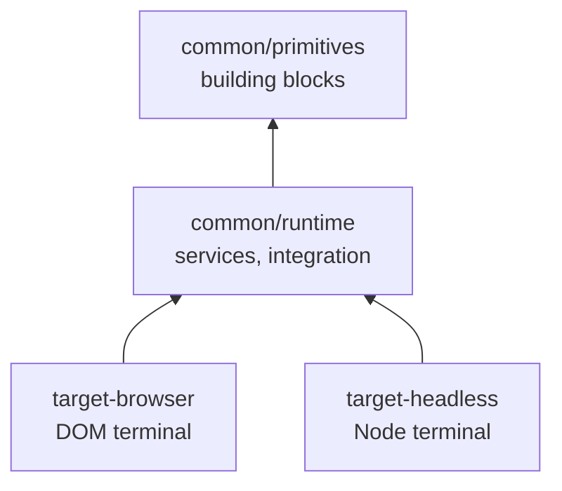

# xterm.js source architecture

This document describes how `src/` is organized. The layout follows [issue #5963](https://github.com/xtermjs/xterm.js/issues/5963): **primitives** and **runtime** as separate TypeScript composite projects, with **target-browser** and **target-headless** as platform entry points.

## Dependency graph

## TypeScript projects

| Project | `tsconfig` | Output | Role |
| --- | --- | --- | --- |
| Primitives | `src/common/primitives/tsconfig.json` | `out/common/primitives/` | Buffer, parser, input helpers, static data, shared utilities. Must not import from `runtime/`. |
| Runtime | `src/common/runtime/tsconfig.json` | `out/common/runtime/` | Services (DI), `CoreTerminal`, `InputHandler`, public API adapters, `Types.ts`. References primitives. |
| Common (solution) | `src/common/tsconfig.json` | — | Solution root; references primitives + runtime only. |
| Target browser | `src/target-browser/tsconfig.json` | `out/target-browser/` | Browser rendering, input, public `Terminal`. References common. |
| Target headless | `src/target-headless/tsconfig.json` | `out/target-headless/` | Headless terminal. References common. |

Unit test files (`**/*.test.ts`) are excluded from composite library builds; they are compiled via esbuild for `npm run test-unit`.

## `common/primitives/`

| Area | Contents |
| --- | --- |
| Root utilities | `Async`, `CircularList`, `Color`, `ColorTypes`, `Event`, `KeyboardTypes`, `Lifecycle`, `MultiKeyMap`, `Platform`, `SortedList`, `StringBuilder`, `TaskQueue`, `TerminalOptions`, `Version` |
| `buffer/` | Screen buffer, `CellTypes`, `BufferService` / `BufferOptions` / `BufferLog` interfaces (buffer-layer contracts) |
| `data/` | `Charsets`, `EscapeSequences` |
| `input/` | UTF decoding, keyboard helpers, `UnicodeTypes`, `UnicodeProperties` |
| `parser/` | Escape-sequence parser |

Primitives depend only on other primitives (and `@xterm/xterm` typings where needed). Buffer code uses `IBufferService` from `common/buffer/BufferService`, not `common/services/Services`.

## `common/runtime/`

| Area | Contents |
| --- | --- |
| `services/` | DI implementations (`BufferService`, `OptionsService`, …) |
| `public/` | Public API adapters (`AddonManager`, buffer/parser views) |
| Root | `CoreTerminal`, `InputHandler`, `WindowsMode`, `Types.ts`, `TestUtils.test.ts` |

`Types.ts` re-exports primitive types and adds integration types (`IInputHandler`, `ICoreTerminal`, mouse/color helpers, etc.).

## Import paths

Source keeps the `common/...` prefix. Each project's `paths` in `tsconfig.json` map that prefix to the correct layer (primitives first, then runtime, for targets).

Platform code uses:

- `target-browser/...` — was `browser/...`
- `target-headless/...` — was `headless/...`

## Published packages vs source folders

The npm package directory `headless/` (e.g. `headless/lib-headless/`) is unchanged; only the **source** tree uses `src/target-headless/`.

## Related issues

- [#5963](https://github.com/xtermjs/xterm.js/issues/5963) — module split
- [#5896](https://github.com/xtermjs/xterm.js/issues/5896) — relative imports
- [#5897](https://github.com/xtermjs/xterm.js/issues/5897) — `import/no-cycle` lint
