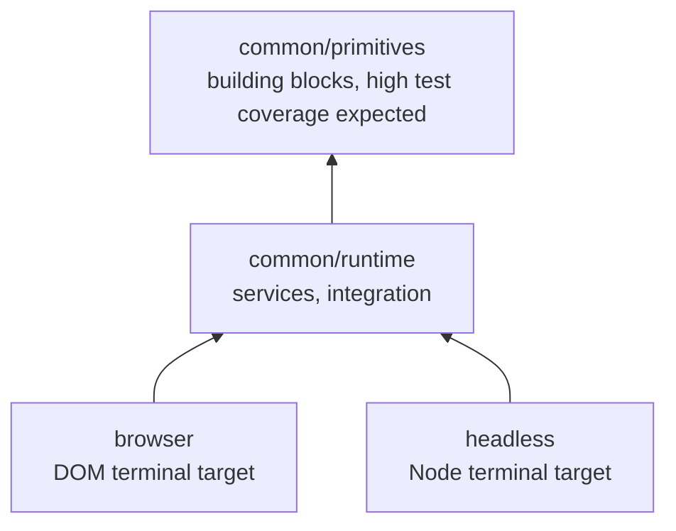
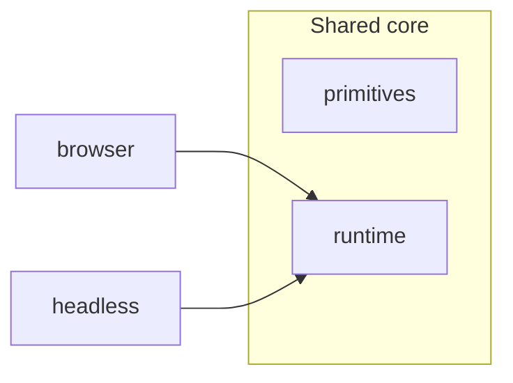

# xterm.js source architecture

This document describes how `src/` is organized, with emphasis on the shared core under `src/common/`. The layout follows the refined proposal in [issue #5963](https://github.com/xtermjs/xterm.js/issues/5963): separate **primitives** (building blocks) from **runtime** (services and integration), while **browser** and **headless** remain target-specific entry points.

## Layer overview

| Layer | Path | Role |
| --- | --- | --- |
| Primitives | `src/common/primitives/` | Low-level, mostly stateless building blocks: buffer, parser, escape/input helpers, static data, and shared utilities. These modules should be easy to unit test in isolation. |
| Runtime | `src/common/runtime/` | Stateful services (DI), `CoreTerminal`, `InputHandler`, public API adapters under `public/`, and other code that wires primitives into a working terminal core. |
| Shared types | `src/common/Types.ts` | Cross-cutting interfaces and types used by both layers (kept at the `common/` root until a stricter module API is introduced). |
| Browser target | `src/browser/` | Browser-only rendering, input, and the public `Terminal` wrapper. |
| Headless target | `src/headless/` | Node-oriented terminal without DOM; same public API shape as the browser build where applicable. |

## `common/primitives/`

| Area | Contents |
| --- | --- |
| Root utilities | `Async`, `CircularList`, `Color`, `Event`, `Lifecycle`, `MultiKeyMap`, `Platform`, `SortedList`, `StringBuilder`, `TaskQueue`, `Version` |
| `buffer/` | Screen buffer, cells, lines, markers, reflow |
| `data/` | Static tables (`Charsets`, `EscapeSequences`) |
| `input/` | UTF decoding, keyboard helpers, write buffer, color parsing |
| `parser/` | Escape-sequence parser (CSI, OSC, DCS, APC) |

**Goals**

- Prefer comprehensive unit tests here; behavior should be understandable without constructing the full terminal stack.
- Avoid importing from `runtime/` when possible. Some legacy edges still reach into `common/services` (for example buffer logging hooks); tightening that is follow-up work, not a blocker for the folder split.
- Future work may split primitives into finer TypeScript projects (`base`, `encoding`, `buffer`, …) with enforced one-way references.

## `common/runtime/`

| Area | Contents |
| --- | --- |
| `services/` | Dependency-injection services (`BufferService`, `OptionsService`, `CoreService`, …) |
| `public/` | Public API surface adapters (`AddonManager`, buffer/parser API views) |
| Root integration | `CoreTerminal`, `InputHandler`, `WindowsMode`, test helpers (`TestUtils.test.ts`) |

**Goals**

- Own composition: instantiation, service registry, and the large integration classes (`InputHandler`).
- May depend on `primitives/` and on `common/Types.ts`; must not be depended on by primitives in the steady state (existing cycles are technical debt to remove incrementally).
- Integration and addon-facing behavior is validated by unit tests here and by browser/headless/integration tests at the target layer.

## Import paths

Source continues to use the existing `common/...` import prefix (for example `common/buffer/Buffer`, `common/services/Services`). TypeScript `paths` in `tsconfig.json` files map that prefix onto `primitives/`, `runtime/`, and the `common/` root so this restructure did not require mass import rewrites.

## Targets vs core

Browser and headless add platform code (renderers, DOM, Node specifics) on top of the same runtime core. Addons and the demo build against the published packages; their tsconfigs use the same `common/*` path mapping.

## Related issues

- [#5963](https://github.com/xtermjs/xterm.js/issues/5963) — module split and TypeScript project structure
- [#5896](https://github.com/xtermjs/xterm.js/issues/5896) — relative imports (possible follow-up)
- [#5897](https://github.com/xtermjs/xterm.js/issues/5897) — `import/no-cycle` lint enforcement
