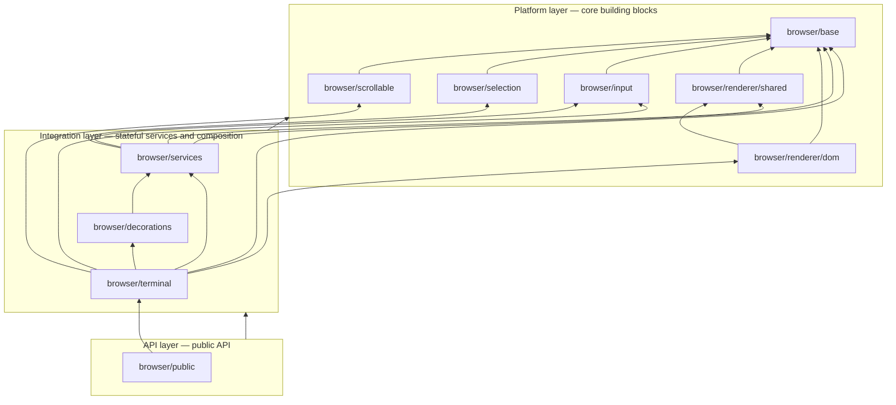

# Browser folder rearchitecture

This document proposes splitting `src/browser/` into composite TypeScript projects with enforced dependencies, mirroring the layered layout planned for `src/common/`.

## Dependency graph

Every arrow is a TypeScript project reference (`tsconfig` `references`). Lower layers must not import from higher layers.

## Package contents

### Platform layer

| Project | Role | Source (current → target) |
| --- | --- | --- |
| `browser/base` | DOM helpers, shared types, constants, theme/contrast utilities, **browser service interfaces** | `Dom.ts`, `Types.ts`, `LocalizableStrings.ts`, `ColorContrastCache.ts`, `TimeBasedDebouncer.ts`, `shared/`; extract interfaces from `services/Services.ts` |
| `browser/scrollable` | Scrollbar / scrollable element widgets (VS Code–derived) | `scrollable/**` (already isolated; `touch.ts` imports `base/Dom`) |
| `browser/selection` | Selection geometry model | `selection/**` |
| `browser/input` | Pointer geometry and selection cursor motion | `input/Mouse.ts`, `input/MoveToCell.ts` |
| `browser/renderer/shared` | Renderer-agnostic types and helpers | `renderer/shared/**` |
| `browser/renderer/dom` | DOM row factory and renderer | `renderer/dom/**` |

`browser/selection` and `browser/input` today depend only on `common/`. After `selection` is tied to `base`, it should depend on `browser/base` only for shared browser types (if any); `SelectionModel` can stay on `common` services alone.

### Integration layer

| Project | Role | Source (current → target) |
| --- | --- | --- |
| `browser/services` | Browser DI services and render debouncing | `services/**`, `RenderDebouncer.ts` |
| `browser/decorations` | Buffer / overview decoration rendering | `decorations/**` (`ColorZoneStore` is common-only; renderers need services) |
| `browser/terminal` | `CoreBrowserTerminal` and UI orchestration | `CoreBrowserTerminal.ts`, `Viewport.ts`, `Linkifier.ts`, `Clipboard.ts`, `AccessibilityManager.ts`, `OscLinkProvider.ts`, `input/CompositionHelper.ts` (moved — see below) |

### API layer

| Project | Role | Source |
| --- | --- | --- |
| `browser/public` | Public `Terminal` export | `public/Terminal.ts` |

## Breaking upward dependencies

A strict platform layer requires moving **interface-only** imports out of implementations:

| Today | Change |
| --- | --- |
| `renderer/shared/TextBlinkStateManager` → `browser/services/Services` | `ICoreBrowserService` (and related) live in `browser/base`; `TextBlinkStateManager` depends on `base` only |
| `input/CompositionHelper` → `browser/services/Services` | Move `CompositionHelper` to `browser/terminal`; it wires IME UI to `IRenderService` at integration time |
| `services/Services.ts` → `renderer/shared/Types`, `selection/Types` | Keep type-only imports, or duplicate minimal event types in `base` if needed to avoid `services` → `renderShared` for types only |
| `services/RenderService` → `browser/RenderDebouncer` | Colocate `RenderDebouncer` under `services/` |

## External importers

Path alias `browser/*` → `src/browser/*` stays valid as files move (e.g. `browser/base/Types`). Addons and tests that import `browser/Types`, `browser/Dom`, etc. will need path updates when `base/` lands.

## Umbrella project

Replace the single `src/browser/tsconfig.json` with a solution-style config that references, in build order:

1. `base`, `scrollable`, `selection`, `input`, `renderer/shared`, `renderer/dom`
2. `services`, `decorations`, `terminal`
3. `public`

`tsconfig.all.json` continues to reference `src/browser` (umbrella) or lists each sub-project explicitly.

## Parity with `common/`

| Common layer | Browser analogue |
| --- | --- |
| Platform (`base` → `input`) | Platform (`base` → `renderer/dom`) |
| Integration (`services`, `terminal`) | Integration (`services`, `decorations`, `terminal`) |
| API (`public`) | API (`public`) |

Browser adds UI-specific platform packages (`scrollable`, `renderer/*`, `selection`) that have no direct counterpart in headless/common-only code.
