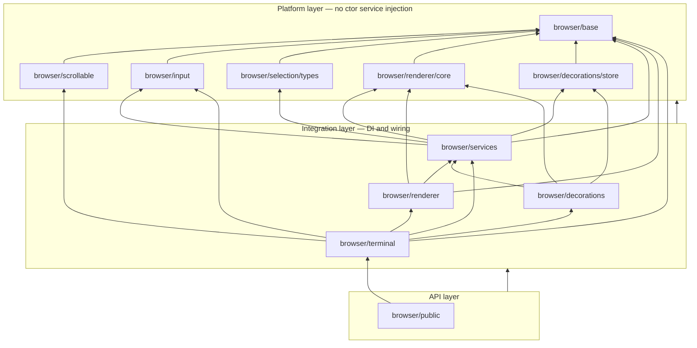

# Browser folder rearchitecture

Composite TypeScript projects with enforced dependencies, mirroring the layered layout planned for `src/common/`.

## Platform layer rule

A module is **platform** only if **no class** in that project has a **service** injected via its constructor. That includes:

- Common services (`@IBufferService`, `@IOptionsService`, `@ICoreService`, `@IInstantiationService`, etc.)
- Browser services (`@ICoreBrowserService`, `@IRenderService`, `@IThemeService`, `@ICharSizeService`, …)

Passing a service into a **function** (e.g. `moveToCellSequence(…, bufferService)`) is fine. `new TextBlinkStateManager(…, coreBrowserService, optionsService)` is not — that class belongs in integration.

Interface-only modules (`browser/selection/Types.ts`, `renderer/shared/Types.ts`) are platform. Implementations that take services are not.

## Dependency graph (corrected)



`browser/renderer` is **not** platform: it owns `DomRenderer`, `DomRendererRowFactory`, and `TextBlinkStateManager`, all of which take injected services.

## Constructor audit (current tree)

### Platform-eligible

| Location | Type | Notes |
| --- | --- | --- |
| `Dom.ts`, `Types.ts`, `LocalizableStrings.ts`, `ColorContrastCache.ts`, `TimeBasedDebouncer.ts`, `shared/` | classes / functions | no DI |
| `scrollable/**` | widgets | `touch.ts` uses `Dom` only |
| `input/Mouse.ts` | functions | pure DOM math |
| `input/MoveToCell.ts` | functions | `IBufferService` passed as argument, not ctor-injected |
| `selection/Types.ts` | interfaces | no classes with DI |
| `renderer/shared/Constants.ts`, `RendererUtils.ts`, `Types.ts`, `SelectionRenderModel.ts` | classes | no DI |
| `renderer/dom/WidthCache.ts` | class | canvas factory only, no services |
| `decorations/ColorZoneStore.ts` | class | common types only, no DI |

### Integration-only (ctor service injection)

| Location | Injected services (representative) |
| --- | --- |
| `selection/SelectionModel.ts` | `IBufferService` |
| `input/CompositionHelper.ts` | `IBufferService`, `IOptionsService`, `ICoreService`, `IRenderService` |
| `renderer/shared/TextBlinkStateManager.ts` | `ICoreBrowserService`, `IOptionsService` |
| `renderer/dom/DomRendererRowFactory.ts` | `ICharacterJoinerService`, `IOptionsService`, `ICoreBrowserService`, `ICoreService`, `IDecorationService`, `IThemeService` |
| `renderer/dom/DomRenderer.ts` | `IInstantiationService`, `ICharSizeService`, `IOptionsService`, `IBufferService`, `ICoreService`, `ICoreBrowserService`, `IThemeService`; creates `DomRendererRowFactory` via `IInstantiationService` |
| `renderer/dom/DomRenderer` inner `CursorBlinkStateManager` | `ICoreBrowserService` |
| `services/**` | common + browser services (all `@…` ctor params) |
| `RenderDebouncer.ts` | `ICoreBrowserService` |
| `decorations/BufferDecorationRenderer.ts`, `OverviewRulerRenderer.ts` | `IBufferService`, `ICoreBrowserService`, `IDecorationService`, `IRenderService`, `IThemeService`, … |
| `Viewport.ts`, `Linkifier.ts`, `AccessibilityManager.ts`, `OscLinkProvider.ts` | multiple common + browser services |
| `CoreBrowserTerminal.ts` | orchestrates service registration and renderer construction |

`Clipboard.ts` has no class ctor DI; handlers receive `ISelectionService` at call sites — keep with `terminal`.

## Target package layout

### Platform

| Project | Contents |
| --- | --- |
| `browser/base` | `Dom`, `Types`, `LocalizableStrings`, `ColorContrastCache`, `TimeBasedDebouncer`, `shared/`; browser **service interfaces** (extracted from `services/Services.ts`) |
| `browser/scrollable` | `scrollable/**` |
| `browser/input` | `Mouse.ts`, `MoveToCell.ts` only |
| `browser/selection/types` | `selection/Types.ts` (or merge into `base` if preferred) |
| `browser/renderer/core` | `renderer/shared/{Constants,RendererUtils,Types,SelectionRenderModel}.ts`, `renderer/dom/WidthCache.ts` |
| `browser/decorations/store` | `ColorZoneStore.ts` |

`SelectionModel` moves to **`browser/services`** (only consumer is `SelectionService`).

`CompositionHelper` moves to **`browser/terminal`** (or `browser/input/ime` as integration sibling).

`TextBlinkStateManager`, `DomRenderer`, `DomRendererRowFactory` move to **`browser/renderer`** (integration), depending on **`browser/services`**.

### Integration

| Project | Contents |
| --- | --- |
| `browser/services` | `services/**`, `selection/SelectionModel.ts`, `RenderDebouncer.ts` |
| `browser/renderer` | `TextBlinkStateManager.ts`, `renderer/dom/DomRenderer.ts`, `DomRendererRowFactory.ts` (+ tests) |
| `browser/decorations` | `BufferDecorationRenderer.ts`, `OverviewRulerRenderer.ts` |
| `browser/terminal` | `CoreBrowserTerminal.ts`, `Viewport.ts`, `Linkifier.ts`, `Clipboard.ts`, `AccessibilityManager.ts`, `OscLinkProvider.ts`, `CompositionHelper.ts` |

### API

| Project | Contents |
| --- | --- |
| `browser/public` | `public/Terminal.ts` |

## Build order

1. `base`, `scrollable`, `input`, `selection/types`, `renderer/core`, `decorations/store`
2. `services`
3. `renderer`, `decorations`
4. `terminal`
5. `public`

## Why `renderer/dom` is not platform

`DomRenderer` (abbreviated):

```ts
constructor(
  …,
  @IInstantiationService instantiationService: IInstantiationService,
  @ICharSizeService private readonly _charSizeService: ICharSizeService,
  @IOptionsService private readonly _optionsService: IOptionsService,
  @IBufferService private readonly _bufferService: IBufferService,
  @ICoreService private readonly _coreService: ICoreService,
  @ICoreBrowserService private readonly _coreBrowserService: ICoreBrowserService,
  @IThemeService private readonly _themeService: IThemeService
) {
  this._rowFactory = instantiationService.createInstance(DomRendererRowFactory, document);
  this._textBlinkStateManager = this._register(new TextBlinkStateManager(…, this._coreBrowserService, this._optionsService));
}
```

`DomRendererRowFactory` similarly injects `ICharacterJoinerService`, `ICoreBrowserService`, `IThemeService`, and other services. So **`renderer/dom` → `browser/services`** (and common services) today; the corrected graph places the whole DOM renderer stack in integration, with only `WidthCache` left in `renderer/core`.

## Parity with `common/`

Common platform modules contain algorithms and data structures without terminal service wiring. Browser platform modules are the same: DOM/scroll utilities, pointer math, renderer **primitives** (`WidthCache`, selection render geometry), and shared types — not renderers or IME helpers that pull `IRenderService` / `IThemeService` from DI.
