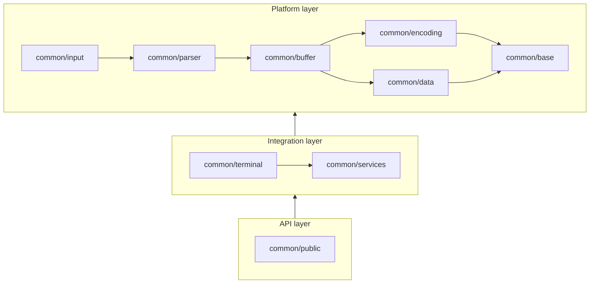

# Common folder rearchitecture

Layered layout for `src/common/` as proposed in [issue #5963](https://github.com/xtermjs/xterm.js/issues/5963).

## Dependency graph (target)

## Package contents

| Project | Role | Notable sources |
| --- | --- | --- |
| `common/base` | Core utilities (lifecycle, events, platform) | `Async`, `Event`, `Lifecycle`, `Platform`, `StringBuilder`, `Version` |
| `common/encoding` | UTF conversion | `TextDecoder` (moved from `input/`) |
| `common/data` | Static terminal data | `Charsets`, `EscapeSequences` |
| `common/buffer` | Screen buffer | `Buffer`, `BufferLine`, … |
| `common/parser` | Escape sequence parser | `EscapeSequenceParser`, … |
| `common/input` | Keyboard / write path helpers | `Keyboard`, `WriteBuffer`, … |
| `common/services` | DI services and shared types | `Services`, `Types`, `CircularList`, … |
| `common/terminal` | Core terminal + input handler | `CoreTerminal`, `InputHandler`, `WindowsMode` |
| `common/public` | Public API adapters | `AddonManager`, buffer API views |

## TypeScript projects

- **`common/tsconfig.json`** — composite build for all layers (resolves existing `buffer` ↔ `services` imports).
- **`common/<layer>/tsconfig.json`** — per-layer config extending the root (`noEmit`) for tooling and future split into referenced composite projects.

Enforcing one-way project references at compile time (separate `out` per layer) is follow-up work once `Types` and buffer service interfaces are decoupled.
