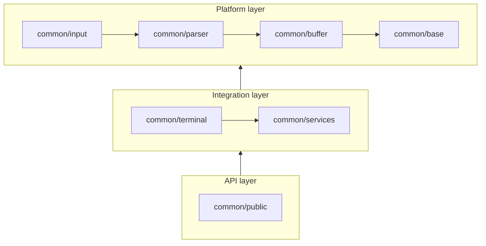

# Common folder rearchitecture

Layered layout for `src/common/` as proposed in [issue #5963](https://github.com/xtermjs/xterm.js/issues/5963).

## Dependency graph (target)

## Package contents

| Project | Role | Notable sources |
| --- | --- | --- |
| `common/base` | Core utilities, UTF conversion, static terminal data | `Async`, `Event`, `Lifecycle`, `Color`, `TextDecoder`, `Charsets`, `EscapeSequences`, … |
| `common/buffer` | Screen buffer | `Buffer`, `BufferLine`, … |
| `common/parser` | Escape sequence parser | `EscapeSequenceParser`, … |
| `common/input` | Keyboard / write path helpers | `Keyboard`, `WriteBuffer`, … |
| `common/services` | DI service implementations | `Services`, `Types` (modes, mouse, osc link), … |
| `common/terminal` | Core terminal + input handler | `CoreTerminal`, `CoreTerminalTypes`, `InputHandler`, … |
| `common/public` | Public API adapters | `AddonManager`, buffer API views |

## TypeScript projects

- **`common/tsconfig.json`** — solution root; references each layer project (no sources).
- **`common/<layer>/tsconfig.json`** — self-contained composite project (`lib`, `paths`, `types`, `references`, `outDir`). Test files (`**/*.test.ts`) are excluded from composite builds; unit tests compile via esbuild.

Buffer-layer code depends on `buffer/BufferService`, `buffer/BufferOptions`, and `buffer/BufferLog` instead of `services` so the `buffer` project does not reference `services`.
